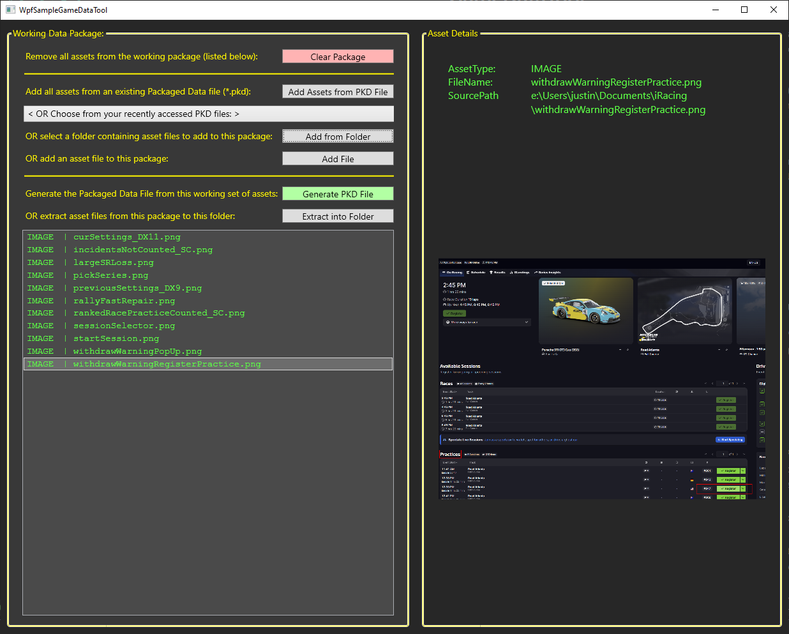

# GameDataTool

GameDataTool is a sample/demo solution that could help with packaging game asset files for deployment. It's composed of a few projects: a Windows GUI application, a console application, and an underlying library, all written in VS 2026 with C#.

GameDataTool allows you to build up a data package, by adding asset files (images, textures, meshes, sounds, scripts, etc.) individually, from all within a folder, or from another already packaged data file.  You can then generate the Packaged Data File (.PKD), which will contain header/meta data and all of your assets, sequentially.

I created this tool primarily as an interesting side-project to better understand a game development data pipeline and to refresh my knowledge of wpf and xaml for Windows GUI apps.

## Developers
Justin Cooke

## Development Environment
I targeted this tool to modern Windows machines and used these IDEs, utilities, and frameworks:
* **Microsoft Visual Studio 2026 - Community Edition 18.1.1** - IDE (https://visualstudio.microsoft.com/)
* **Microsoft .NET 10.0** - Framework (https://dotnet.microsoft.com/en-us/)
* **Notepad++** - Powerful text editor (https://notepad-plus-plus.org/)
* **HxD** - Hex editor and viewer (https://mh-nexus.de/en/hxd/)

## Features
* Interact with the GameDataTool through either a Windows GUI or console application.
* Build up a data package, which is intended to contain all game assets for a single entity (such as a car or track in a racing game).  These assets may include images, textures, meshes, sounds, scripts, etc..
* You can add files individually or by importing all supported file types from within a folder.  You can also load all asset files from a previously generated Packaged Data File (.PKD).
* Once satisfied with the full entity's data package, you can generate that PKD file.  The PKD will include header/meta data describing the file contents and then all individual asset files from this package sequentially following the header.
* The Windows GUI application implements some simple tool state persistence by maintaining the last used window state/size/position and the most recently accessed folders and PKD files.
* The tool includes a somewhat simplistic checksum calculation stored with the PKD file's metadata and then used on subsequent imports to confirm that the file hasn't been modified.

## Usage
### If using the **Windows GUI application** (WpfSampleGameDataToolGUI):
* You build the working data package (all assets for a single game entity, such as a car or track) with the buttons on the left-side pane.  They're basically self-explanatory: you can choose to add an individual file, all files from a folder, or all files contained in an already-generated PKD file.
* You can see all assets within your package in the left-side ListBox.  If you click on any of those, IMAGEs will be displayed on the right-side.  Other asset types aren't previewed.
* Once satisfied with the full package, you can generate the single PKD file, which will contain the consolidated assets for distribution.

### If using the **console application** (SampleGameDataToolConsole):
* You run the tool from the command line, passing argumnents to control which asset files are used to generate a PKD file.
* These are the supported arguments:

	| Argument | Description/Usage |
	|----------|-------------------|
	| `-packFromFolder` | pass the folder from which to import all supported assets into the working package |
	| `-outFolder` | pass the folder into which the generated PKD file should be placed |
	| `-outBaseName` | pass the base name of the generated PKD file (a dateTime stamp will be appended) |
	| `-useChecksum` | this is only a flag (don't pass anything else) that the tool should use the checksum |
	| `-testingCycle` | this is only a flag (don't pass anything else) that the tool should extract the asset files from all PKD files found in the outFolder path |
* Here's a sample call: `SampleGameDataToolConsole.exe  -testingCycle   -packFromFolder "e:\Users\justin\Documents\iRacing"  -outBaseName "thisIsATest" -useChecksum -outFolder e:\Users\justin\Documents\iRacing\test10`

## Interesting Development Notes
* **Persistence** I wanted to maintain at least a simplified version of user settings/persistence.  This GUI app will remember and restore the user's last window state (state, size, and position) and their last-accessed folder and PKD files.  I primarily used the default User-scoped settings feature, with a very minor customization to store the recently-accessed PKD file list (that's needed because the default settings mechanism can only store simple types, like strings -- not collections or lists.  I only joined the paths in a single string with the '^' char.  See here in the code: [WpfSampleGameDataToolGUI/ToolUserSettings.cs#L36-L90](WpfSampleGameDataToolGUI/ToolUserSettings.cs#L36-L90)
* **ComboBox Placeholder Text** Somewhat oddly, the xaml ComboBox doesn't support the placeholder text concept (where with no selection, the user can see a kind of hint/placeholder text).  I easily implemented this feature by including a 'placeholder' as the first entry in the list of items.  It's just ignored when processing any ComboBox selections.  See here in the code: [WpfSampleGameDataToolGUI/ToolUserSettings.cs#L53](WpfSampleGameDataToolGUI/ToolUserSettings.cs#L53)
* **Checksum** I felt it would be useful to provide a minimal type of file modification detection, so that the tool could recognize any potentially-corrupted files and reject them for import.  This was handled with a very simple, primitive type of checksum.  I'm only adding every 4 bytes in each asset file's byte[] (read with a BitConverter.ToInt32()) to an Int32 checksum value.  The wrap-around, as the sum exceeds the Int32 capacity, is expected and used in generating the checksum value.  See the code here: [GameDataTool/DataPackage.cs#L98-L111](GameDataTool/DataPackage.cs#L98-L111)

## License
Distributed under the MIT license here: [LICENSE](LICENSE)
